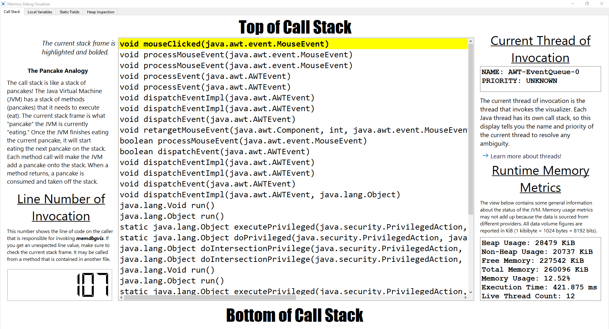
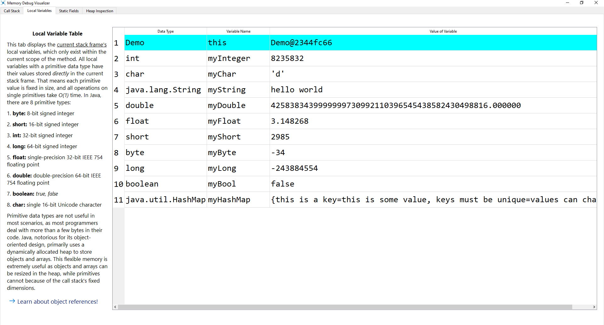
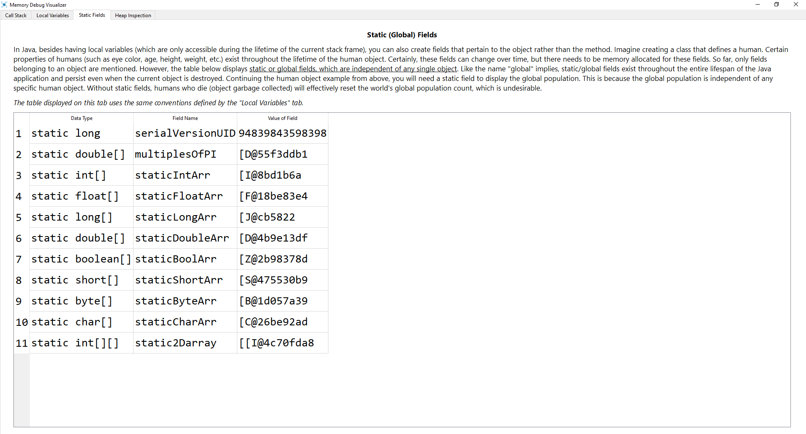
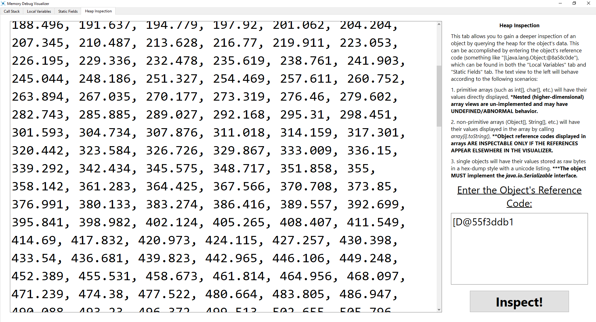
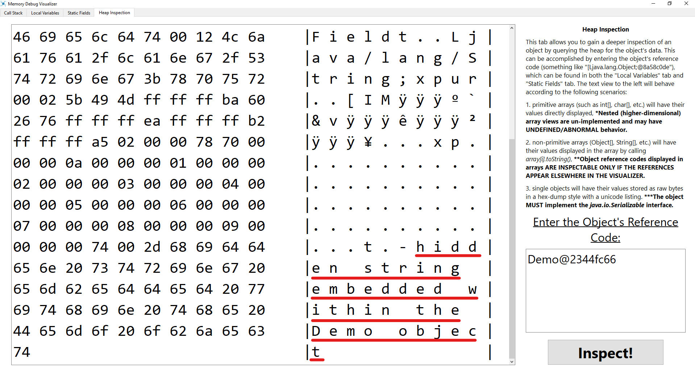
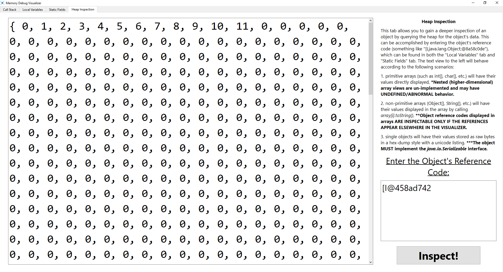
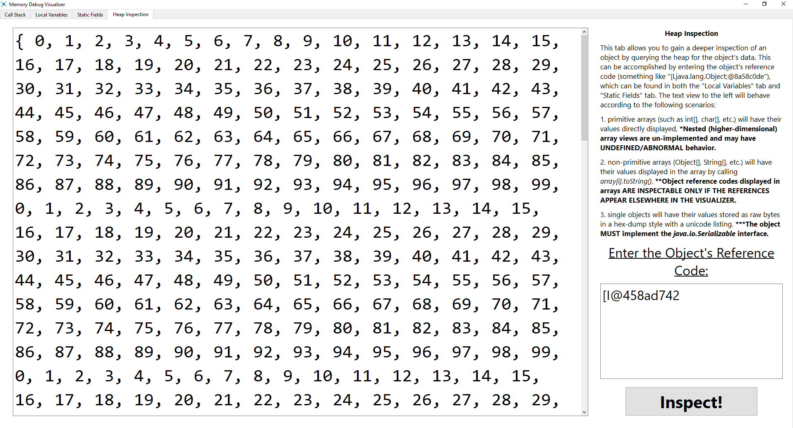

# Memory Debug Visualizer 
Memory Debug Visualizer (*memdbgvis*) is a powerful read-only Java debugger that enables programmers to visualize the state of their program's memory at runtime. With Memory Debug Visualizer, programmers can fine tune the placement of breakpoints in order to closely examine memory contents. Whether you are a novice or experienced programmer, Memory Debug Visualizer empowers you to efficiently identify and address memory-related issues in Java.

## Installing and Setup
To install *memdbgvis*, simply download and extract the latest release zip archive to a suitable file location. Then, go to your preferred Java development environment and the project you wish to debug.  Since *memdbgvis* is IDE agnostic, the general steps outlined below apply to all major Java development environments:

1. Add `C:\file\path\to\extracted\memdbgvis.jar` as an external library/archive to your Java project.
2. Try to `import com.vjzcorp.jvmtools.memdbgvis;` and make sure that it resolves symbols without error.
3. In your IDE, locate the section that modifies the JVM arguments of your program. If you are using the command line, run the following: `java.exe -agentpath:C:\file\path\to\extracted\memdbgvis.dll -OtherVMOptions MyJavaClass`. Either way, you should have the `-agentpath` switch pointing to `memdbgvis.dll` which is in the extracted archive. **Make sure to add this option in the runtime configuration! Do not add it to `javac` as *memdbgvis* is not designed for the compiler.**
4. Finally, place a breakpoint by calling `memdbgvis.visualize();` in your code. Wherever you called this breakpoint, *memdbgvis* will visualize the state of your program when the Java Virtual Machine (JVM) executes that line. See below for tips on how to effectively use *memdbgvis*.

If you have any problems making *memdbgvis* work for your specific environment, open a issue and we will try to resolve it.

## Features
Explore the list of features available in *memdbgvis* in this section. Each feature comes with detailed captions and information boxes that are thoughtfully designed to enhance your understanding of your program's memory.

### Call Stack Tab
The Call Stack tab shows general information about the current state of your Java program. It includes the following features:
- **Line Number of Invocation**: The number displayed indicates the line number to which the visualization corresponds, reflecting the placement of the associated breakpoint.
- **Call Stack View**: This main view displays the complete call stack of the current thread along with every method pertaining to the call stack.
- **Current Thread of Invocation**: This display presents the current thread and priority from which *memdbgvis* was invoked.
- **Runtime Memory Metrics**: This display provides runtime metrics of your program, enabling you to diagnose the performance of the JVM.

Shown below is a screenshot of the Call Stack tab in action:


### Local Variables Tab
The Local Variables tab displays variables in the current method, capturing the stack frame's state for the programmer's reference. Additionally, the reference `this` is highlighted in blue to indicate whether the stack frame is for an instance or static method. The screenshot shown below shows the Local Variables tab in use:


### Static Fields Tab
The Static Fields tab shows debuggee's relevant static fields. This tab helps the programmer understand the current state of the class-level variables. Shown below is a screenshot of the Static Fields tab in action:

At this point, it is worth noting that both the Local Variables and Static Fields tabs attempt to use `.toString()` for displaying an object's visual representation. If `.toString()` is not available, *memdbgvis* will fallback to using the default hashcode provided by the JVM.

### Heap Inspector
The Heap Inspector is an advanced, cutting-edge tool designed to provide a more comprehensive view of an object's contents by extracting data from the heap directly. This tool is extremely useful if a hashcode is generated instead of a `.toString()` visualization as mentioned above. The Heap Inspector has two modes:
- **Array Inspection**: Using the Heap Inspector, it is possible to visualize all the data contained in a one-dimensional array of any type. Shown below is a `double` array visualized using the Heap Inspector:

- **Custom Object Dump**: In addition to its visualization capabilities, the Heap Inspector can dump the memory of an object belonging to a user-defined class. If the class lacks a `.toString()` method, the Heap Inspector can provide a hex dump of the raw bytes of the object with ASCII representation alongside. Below shows a custom `Demo` object being dumped:

If it was not for the Heap Inspector's Custom Object Dump, the red-highlighted string would be inaccessible anywhere else since it is located at a significant depth within the heap.

While the features outlined above offer great versatility, it is crucial to carefully review the information provided within the visualizer to fully comprehend the restrictions of each capability.

## Tips and Tricks
Here are some useful tips and tricks for optimizing your use of *memdbgvis*:
- Memory Debug Visualizer is most effective when you know the general area of your code that is causing a bug. As with other debuggers, placing a breakpoint on every single line of code is not time efficient. Therefore, we recommend isolating the bug down to a specific method and continuing from there.
- Loops can slow down debugging tremendously as it may take hundreds or even thousands of iterations for a bug to happen. Instead of placing a breakpoint like this:

```java
for (int i = 0; i < 999999; i++) {
    nonZeroArray[i] = i % 100; // clearly zeroes out every 100 iterations
    memdbgvis.visualize();
}
```
Place a breakpoint inside a if statement like this:

```java
for (int i = 0; i < 999999; i++) {
    nonZeroArray[i] = i % 100; // clearly zeroes out every 100 iterations
    if (i == someFairlyLargeNumToSkipIterations)
        memdbgvis.visualize();
}
```
This if statement does not even have to fix the bug, it just allows you to skip many iterations and see the state of the array as a whole. Below shows what happens in the first code block:

The image above shows that a programmer may incorrectly think that the array is almost all zeroes but in reality, *memdbgvis* was invoked after a few iterations. Here is the result of the second code block:

After adding a conditional breakpoint, the bug is much more clear: it happens every 100 iterations. These are a few tips that will help you use *memdbgvis* to its fullest potential. If you are interested in sharing additional tips and tricks for using *memdbgvis*, check out the [CONTRIBUTING.md](CONTRIBUTING.md) for more information on how to share your insights.